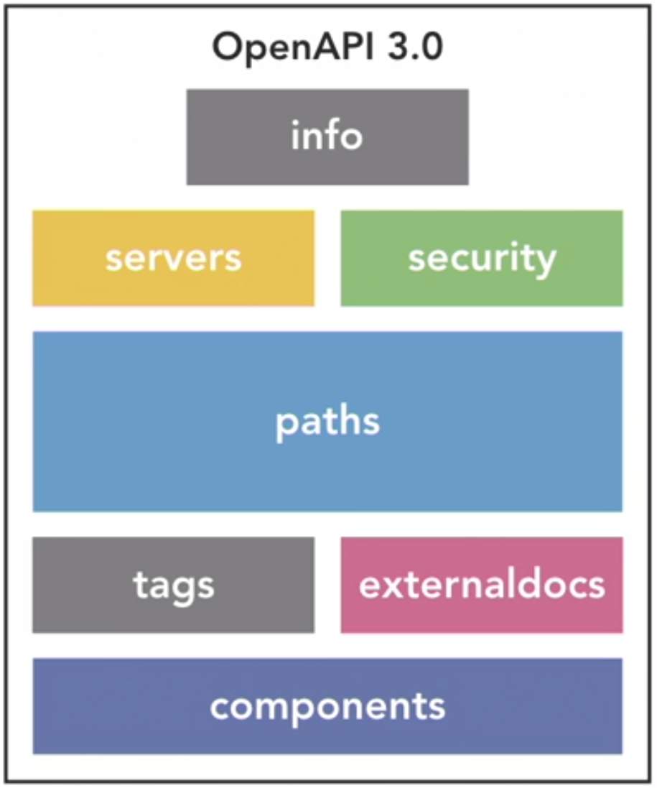

# DEFINIÇÃO DAS ESPECIFICAÇÕES.
Estrutura hierarquica das especificaçÕes.

## PULICAÇÃO DAS DEFINIÇÕES POR VERSÃO DE OPEN-API:
https://github.com/OAI/OpenAPI-Specification/tree/master/versions

## ESPECIFICAÇÕES DE ESTRUTUTA DE SCHEMA OBRIGATÓRIAS E OPCIONAIS DE CADA VERSÃO: EXEMPLO: 3.1
https://github.com/OAI/OpenAPI-Specification/blob/master/versions/3.1.0.md#schema

# CAMPOS OBRIGATÓRIOS PARA O PADRÃO 3.0
-openapi:
-info:
-paths: