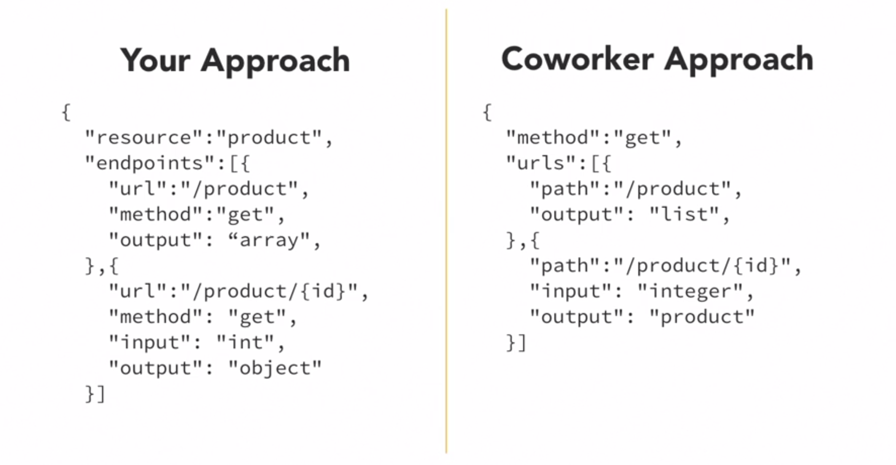
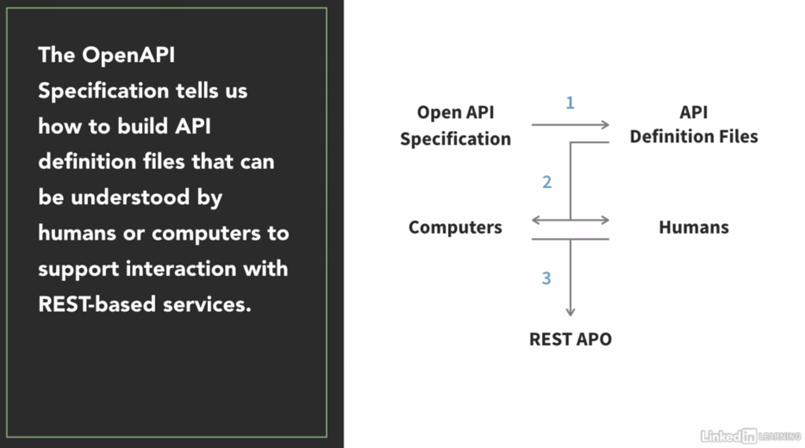

# INTRODUÇÃO.

## PARA QUEM O CURSO É DESENVOLVIDO: 
APIS DEVS
APIS CONSUMERS
TECHNOLOGISTS

## CONHECIMENTOS PRE-REQUISITOS BASICOS
REST
YAML
JSON
java(opcional)
node.js(opcional)

## RESUMO SOBRE APIS.
Proveniente da sigla Application Programming Interface, API's expõem funcionalidades do "core business" para desenvolvedores internos e externos, permitindo a escabilidade de desenvolvimento de software.
A chave para desenvolver APIS eficientes é a utilização de ferramentas que criam arquiteturas padronizadas de API's com documentação.
Para isto utilizaremos a ferramenta Swagger.
É importante termos uma arquitetura e documentação padronizada de API's para escalar o processo de desenvolvimento de software em qualquer negócio, e tornar eficiente a integração de colaboradores internos e externos nas funcionalidades do software do negócio.

# Funcionamento lógico das especificações de API
## Por que especificar e documentar? 
    Pois divergencias podem aparecer, veja: 

### DOCUMENTAÇÕES DE APIS GERAM APIS!