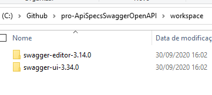

# SWAGGER VS OPENAPI
    Para utilizar o swagger você precisa entender a diferença fundamental entre o Swagger e o OpenApi.

## SWAGER:
    Um toolset com abordagem estruturada para criar design de apis, documentação e código através do lifecycle API.
    Engloba a utilização do OpenAPI em suas funcionalidades.\
    Pode construir SDK's para trabalhar com APIS

## OpenAPI
    Formato padrão de matadata utilizado para definir RESTful services (pesquise os conceitos de restfull web services).
    Padrão mantido por grandes empresas como Microsoft, IBM, Google, etc.

# Planos

## Recursos Free
- Swagger editor
- Swagger UI
- Swagger Codegen

## Recursos Pro
collab features

- Swagger Hub
- Swagger Inspector

# DIAGRAMAS

# Swagger UI
    Permite visualizar e interagir com todos os formatos de input/output dos endpoints.
    Permite também o desenvolvimento em tempo real de documentação conforme o código é produzido.

# Funcionamento lógico das especificações de API
## Por que especificar e documentar? 
    Pois divergencias podem aparecer, veja: 

### DOCUMENTAÇÕES DE APIS GERAM APIS!

# SETUP DE AMBIENTE : SWAGGER EDITOR / SWAGGER UI
## Alternativa 1 : Setup Local do Swagger UI
### Downloads
https://github.com/swagger-api/swagger-ui/releases
https://github.com/swagger-api/swagger-editor/releases
https://nodejs.org/en/

- Descompacte os arquivos zips em uma pasta para um workspace.
    

- Instale o nodejs se não tiver ele em seu sistema operacional.
- Instale o http-server:
  - npm install -g http-server
- Instale o swagger-editor:
  - abra a pasta swagger editor que foi descompactada em seu workspace
  - abra um terminal nesta pasta
  - dê o comando : npm install (levou 10 minutos na minha máquina)
- No terminal volte à pasta raiz do projeto : "workspace" (suba um nivel de diretorio com cd..)
  - instancie o http-server com o swagger-editor:
    - http-server swagger-editor -a 127.0.0.1 -p 8080
    - resposta esperada no terminal:
    	- '''Starting up http-server, serving swagger-editor
          Available on:
          http://127.0.0.1:8080
          Hit CTRL-C to stop the server
      '''
- Abra o endereço em seu navegador procure a pasta do Swagger-editor e teste o acesso

- Em outro terminal volte à pasta raiz do projeto : "workspace" (suba um nivel de diretorio com cd..)
  - instancie o http-server com o swagger-ui:
    - http-server swagger-ui -a 127.0.0.1 -p 8081
    - resposta esperada no terminal:
    	- '''Starting up http-server, serving swagger-ui
            Available on:
            http://127.0.0.1:8081
            Hit CTRL-C to stop the server
        '''

## Alternativa 2 : Uso do Swagger via plataforma Web:
    - Acesse o endereço : https://app.swaggerhub.com/ e crie uma conta
    - Eu criei no meu usuário douglas-2rp

# DEFINIÇÃO DO RUNNING EXAMPLE:
 - Nome do exemplo : H+ sport
  

## SETUP DO RUNNING EXAMPLE NO SWAGGERHUB
No meu caso eu utilizei a alternativa 2 criar o API SPEC do running example.

- Clique em "create-api" e preencha com os dados:
- 